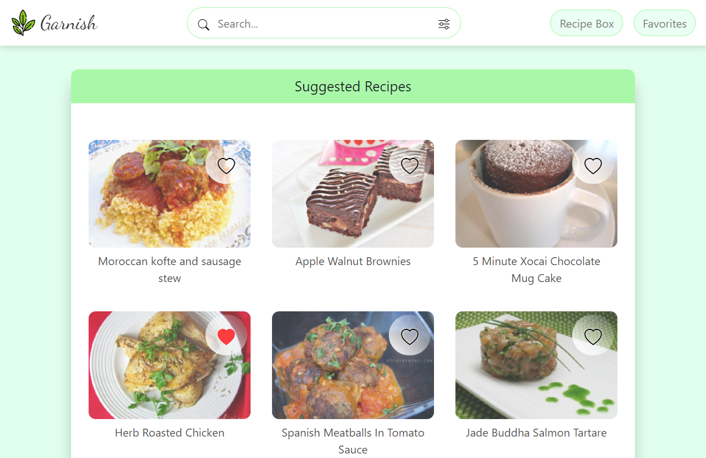
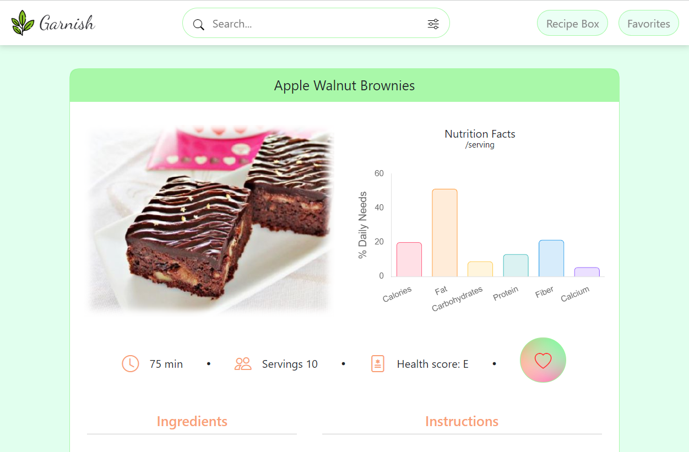
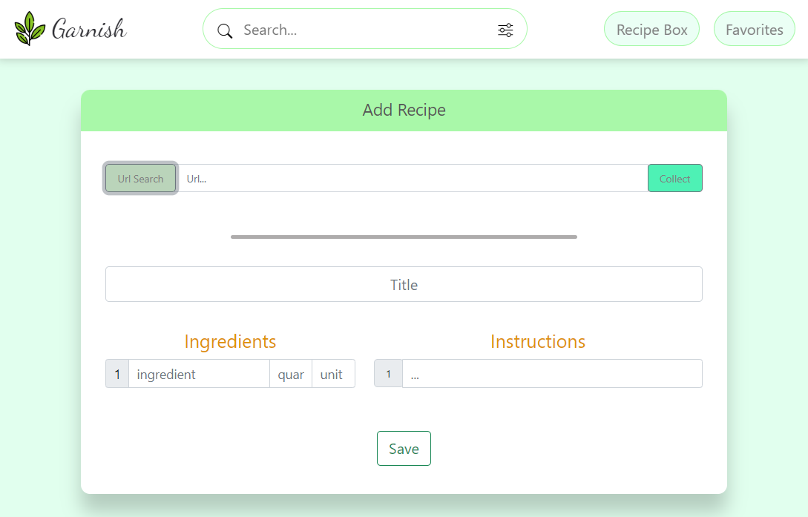

# Garnish

Garnish is an app that enables users to search for recipes and save the ones they most like. Users can also create their own recipes, save them and modify them at any time. Lastly, the app provides users with the ability of pasting any url of a recipe page and save any recipe content locally which can be modified as well.

## Getting started

1. Fork this repo and CLone a copy on your local machine

2. Set up your API key (the recipes available through the app are fetched from the Spoonacular API)
- create an account: https://spoonacular.com/food-api/console#Dashboard
- once logged in, check your profile and copy your API key
- in the server folder,create a .env file and paste the API key as followed: API_KEY1 = " ...your key here... "

3. install the dependencies:
- run **npm i** from the server folder
- run **npm i** from the client folder

4. Start the app
- run **npm start** from the server folder
- run **npm start** from the client folder

## Tech stack

### Front-end:
- 🏗 React
- 💄 CSS & bootstrap
- 📊 Chart.JS
- 🔀 react router

### Back-end
- 🏗 node.js + Express

Misc:
- 🎨 coolors.co (color palettes generator)
- 🗂️ trello
- ✏️ namelix

## Credits

All recipes are fetched from the spoonacular API: https://spoonacular.com/food-api